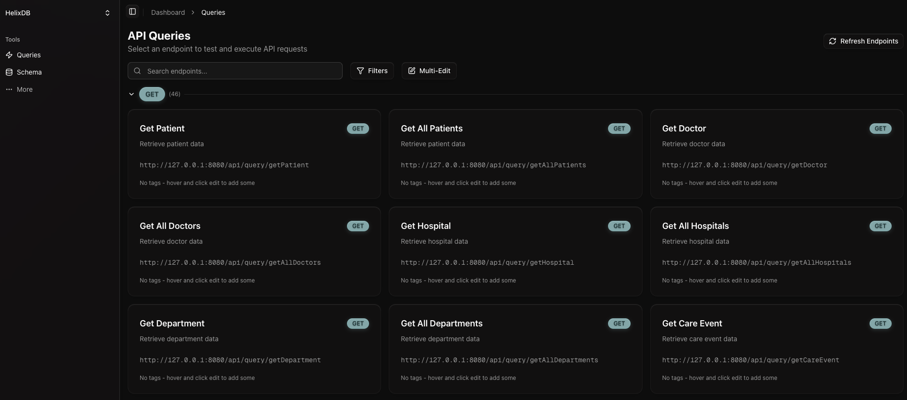

# helix-dashboard

## Overview

This is a dashboard for helixdb. It allows you to view and interact with your helixdb database.

## Query Format

**This works best** if your queries have this format:
- post should start with "create" or "link" e.g "createPatient" or "linkPatientToDoctor"
- get should start with "get" e.g "getPatient" or "getDoctor"
- put should start with "update" e.g "updatePatient" or "updateDoctor"
- delete should start with "delete" e.g "deletePatient" or "deleteDoctor"

## Setup

Backend:
- Local introspect (default): have your helixdb up, then run `cargo run` or `cargo run -- local-introspect`
  - To specify a custom port for your local HelixDB instance: `cargo run -- --port 8888` or `cargo run -- -p 8888`
- Local file: add your helixdb-cfg into the backend folder and run `cargo run -- local-file`
  - To specify a custom port: `cargo run -- local-file --port 8888`
- Cloud mode: run `cargo run -- cloud http://your-helix-db-url:6969`

Frontend:
- Run `npm run dev` to start the frontend
- The frontend will be available at `http://localhost:3000`

