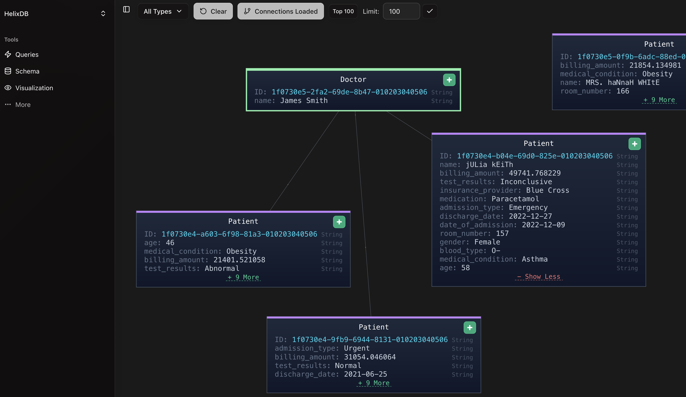
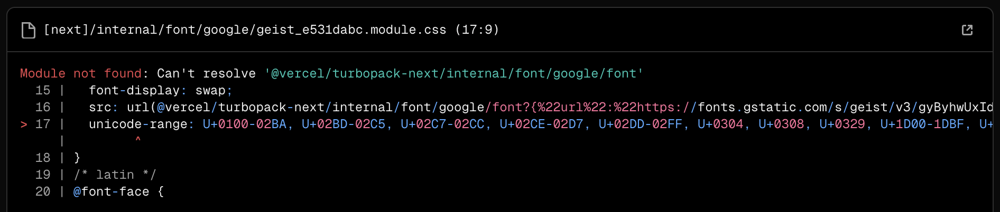

# helix-dashboard

## Overview

This is a dashboard for helixdb. It allows you to view and interact with your helixdb database.

## Query Format

The dashboard works best when your queries follow this naming convention:

- **Creating** or **linking** nodes and edges should start with "create" or "link" (e.g., "createPatient" or "linkPatientToDoctor")
- **Searching** or **getting** nodes and edges should start with "get" (e.g., "getPatient" or "getDoctor")
- **Updating** nodes and edges should start with "update" (e.g., "updatePatient" or "updateDoctor")
- **Deleting** nodes and edges should start with "delete" (e.g., "deletePatient" or "deleteDoctor")

## Setup

Backend:
1. Navigate to the `backend` directory and ensure your HelixDB is running either locally or on a cloud server
2. You then have 3 options:
    - **Local introspect** (default): Run `cargo run` or `cargo run -- local-introspect`
    - **Local file**: Read queries and schema from your local file, add your helixdb-cfg to the backend folder and run `cargo run -- local-file`
    - **Cloud mode**: Run `cargo run -- cloud http://your-helix-db-url:6969`

- For local introspect, you can specify a custom port for your HelixDB instance: `cargo run -- --port 8888` or `cargo run -- -p 8888`
- For local file: `cargo run -- local-file --port 8888`

Frontend:
1. cd into the `frontend` directory and run `npm install` to install the dependencies
2. Run `npm run dev` to start the frontend
3. The frontend will be available at `http://localhost:3000`

## Visualizer Setup (To be changed when merged into dev/main branch)

**NOTE**: 
- You may need to stop your current helixdb instance running on port 6969
- In some browsers like **Brave**, you aren't able to click on all the nodes, brave only allows you to click on 2-3 nodes at most. So I'd recommend using anything but brave.
- I would also not recommend visualizing more than **3000 nodes** it may cause browser to crash

### Setup
1. Pull the `helix-db` repo from https://github.com/HelixDB/helix-db
2. Compile ur schema and queries by running `helix compile` in a terminal where your queries and schema is located
3. Go into helix-db repo and change the branch from `main` to `builtin-endpoints`
4. Drop in the `queries.rs` file into `helix-container/src` folder
    - queries.rs is file that was made when you ran `helix compile`
5. In your terminal inside `helix-db` repo, run `cd helix-container` then run `cargo run --profile dev --features dev-instance`
6. This will run your helixdb instance on port 6969, and you may need to put in your data again.
7. Run the frontend and backend using the steps above, then you can now use the visualizer.

This is the **temporary work-around** until we merge the visualizer into main/dev. Apologies for the inconvenience.

### Troubleshooting
1. Module not found: Can't resolve '@vercel/turbopack-next/internal/font/google/font'

* remove "--turbopack" in package.json
* if the issue still cannot be resolved, you can refer to [this link](https://github.com/vercel/next.js/discussions/61886)